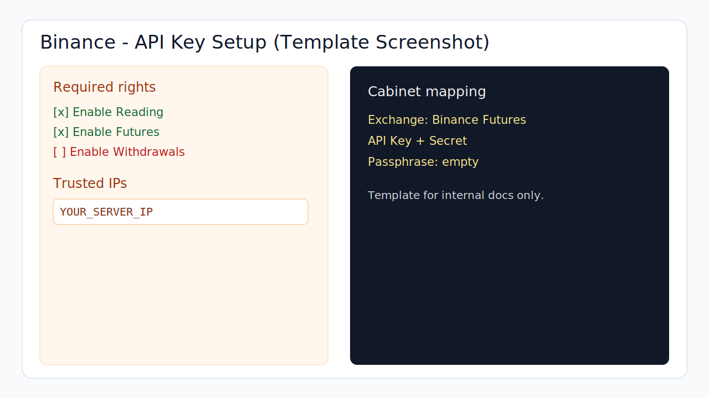

# Binance API Key Quick Guide

## Где создать ключ
- Откройте `Binance -> API Management`.
- Создайте новый API-ключ.

## Какие права включить
- `Enable Reading`.
- `Enable Futures` (или эквивалент для USDT-M Futures).
- Не включайте `Enable Withdrawals`.

## Что скопировать
- `API Key`.
- `Secret Key`.

## Whitelist
- Включите `Restrict access to trusted IPs only`.
- Добавьте IP сервера.

## Что выбрать в ЛК
- В форме ключа выберите `Binance Futures`.
- Вставьте `API Key` и `Secret`.
- `Passphrase` не требуется.

## Быстрый чек
- Есть чтение и фьючерсная торговля.
- Вывод средств через API отключен.
- IP whitelist заполнен.

## Официальная документация
- https://developers.binance.com/docs/derivatives/usds-margined-futures/general-info

## Скриншоты (рекомендуется добавить)
- Создание API-ключа.
- Раздел прав доступа.
- Раздел trusted IPs.

## Шаблон скриншота

