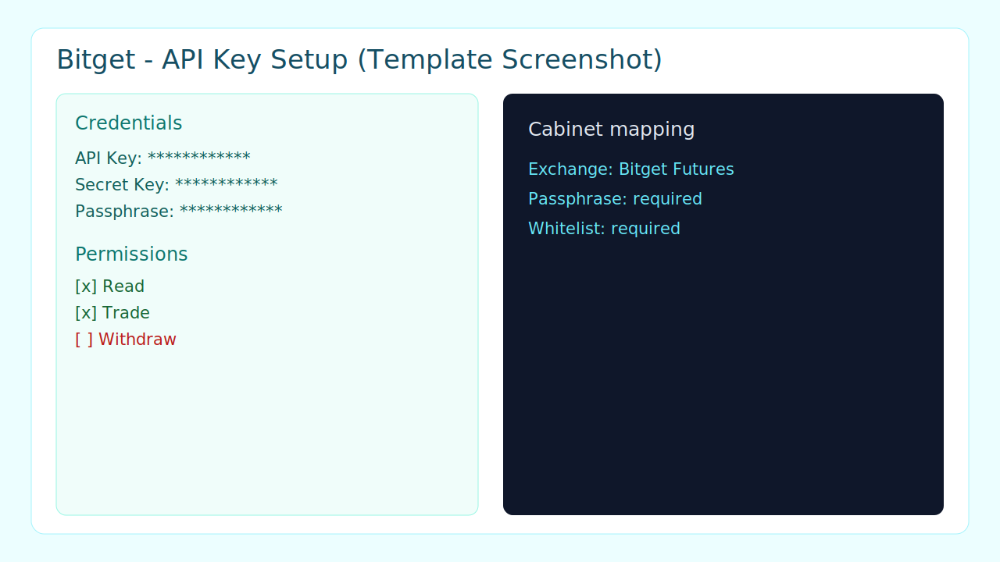

# Bitget API Key Quick Guide

## Где создать ключ
- Откройте `Bitget -> API Management`.
- Нажмите `Create API Key`.

## Какие права включить
- `Read` (или `View`).
- `Trade`.
- Не включайте `Withdraw`.

## Что скопировать
- `API Key`.
- `Secret Key`.
- `Passphrase`.

## Whitelist
- Добавьте IP вашего сервера в whitelist API.
- Без whitelist биржа часто блокирует приватные запросы.

## Что выбрать в ЛК
- В форме ключа выберите `Bitget Futures`.
- Вставьте `API Key`, `Secret`, `Passphrase`.

## Быстрый чек
- Есть права `Read + Trade`.
- Нет права `Withdraw`.
- Заполнен whitelist IP.
- Тест запроса баланса/позиций проходит.

## Официальная документация
- https://www.bitget.com/api-doc/common/quick-start

## Скриншоты (рекомендуется добавить)
- Экран создания API-ключа.
- Экран разрешений (`Read/Trade`, без `Withdraw`).
- Экран whitelist IP.

## Шаблон скриншота

