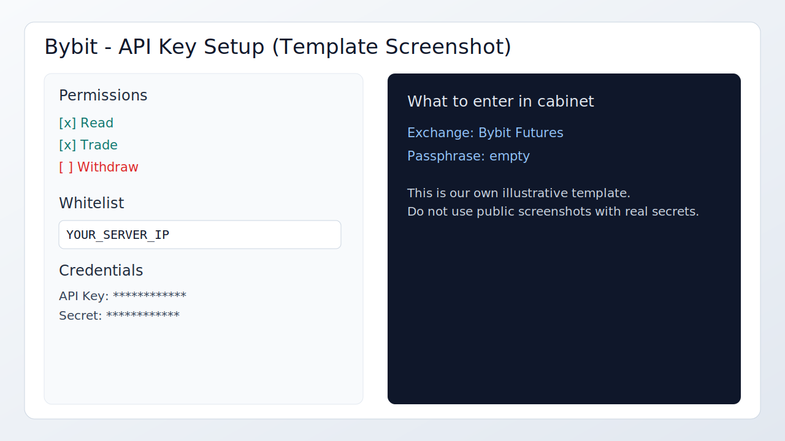

# Bybit API Key Quick Guide

## Где создать ключ
- Откройте `Bybit -> API Management`.
- Создайте новый API-ключ для торговли деривативами.

## Какие права включить
- `Read`.
- `Trade`.
- Не включайте `Withdraw`.

## Что скопировать
- `API Key`.
- `API Secret`.

## Whitelist
- Добавьте IP сервера в whitelist.
- Для стабильной работы лучше фиксированный IP.

## Что выбрать в ЛК
- В форме ключа выберите `Bybit Futures`.
- Вставьте `API Key` и `Secret`.
- Поле `Passphrase` для Bybit оставьте пустым.

## Быстрый чек
- Права `Read + Trade` активны.
- `Withdraw` выключен.
- IP в whitelist совпадает с сервером.

## Официальная документация
- https://bybit-exchange.github.io/docs/v5/intro

## Скриншоты (рекомендуется добавить)
- Создание ключа.
- Разрешения API.
- Настройка IP whitelist.

## Шаблон скриншота

