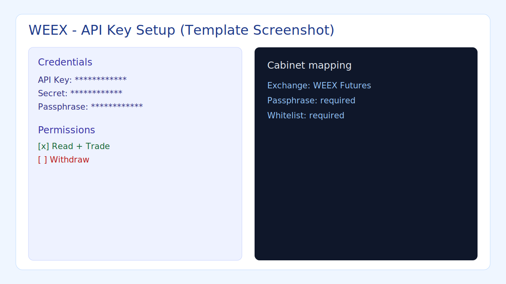

# WEEX API Key Quick Guide

## Где создать ключ
- Откройте `WEEX -> API Management`.
- Создайте ключ для фьючерсной торговли.

## Какие права включить
- `Read`.
- `Trade`.
- Не включайте `Withdraw`.

## Что скопировать
- `API Key`.
- `Secret`.
- `Passphrase`.

## Whitelist
- Добавьте IP сервера в whitelist.
- Для нескольких серверов добавьте все IP заранее.

## Что выбрать в ЛК
- В форме ключа выберите `WEEX Futures`.
- Вставьте `API Key`, `Secret`, `Passphrase`.

## Быстрый чек
- Права `Read + Trade` активны.
- Вывод средств выключен.
- IP whitelist заполнен.

## Официальная документация
- https://www.weex.com/api-doc

## Скриншоты (рекомендуется добавить)
- Создание ключа.
- Раздел прав доступа.
- Раздел whitelist IP.

## Шаблон скриншота

